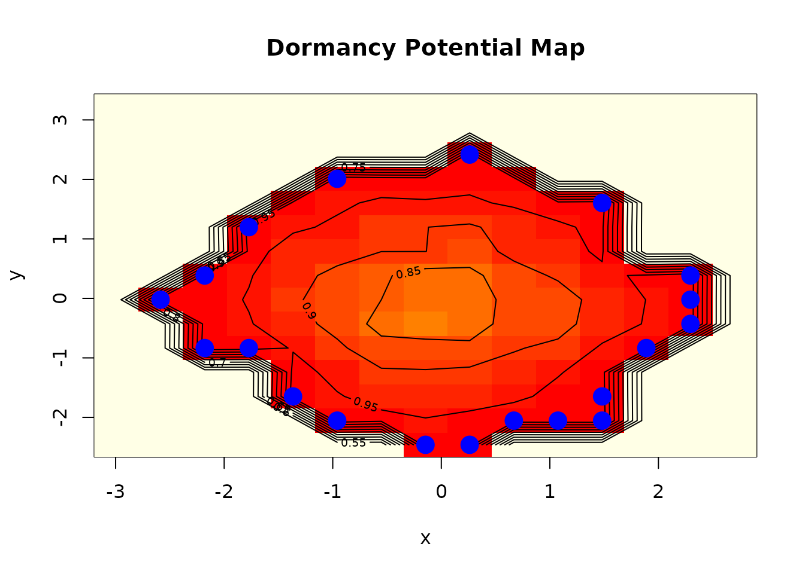

# Introduction to Dormancy: Detecting Hidden Patterns in Data

## Overview

The **dormancy** package introduces a novel framework for detecting and
analyzing *dormant patterns* in multivariate data. Unlike traditional
pattern detection methods that focus on currently active relationships,
dormancy identifies statistical patterns that exist but remain inactive
until specific trigger conditions emerge.

### What are Dormant Patterns?

A dormant pattern is a genuine statistical relationship that is
currently suppressed by prevailing conditions in your data. Consider
these real-world analogies:

- **Biological dormancy**: Seeds can remain dormant for years, only
  germinating when conditions (temperature, moisture) are right
- **Geological dormancy**: Fault lines can be dormant for centuries
  before triggering earthquakes
- **Epidemiological latency**: Pathogens can exist in a latent state
  before becoming active

In data analysis, dormant patterns manifest as:

1.  Relationships that are strong in specific data regions but weak
    overall
2.  Correlations that only emerge when certain threshold conditions are
    met
3.  Patterns hidden by confounding variables that, when controlled for,
    reveal strong associations

### Why Dormancy Matters

Traditional correlation analysis can miss dormant patterns because:

- Aggregate statistics mask conditional relationships
- Weak overall correlations may hide strong local correlations
- Threshold effects create piecewise relationships
- Phase-dependent patterns vary across the data space

The dormancy package addresses these limitations with specialized
detection methods.

## Getting Started

``` r
library(dormancy)
```

### Basic Detection

Let’s create a simple example with a dormant pattern:

``` r
set.seed(42)
n <- 500

# Create variables
x <- rnorm(n)
condition <- sample(c(0, 1), n, replace = TRUE)

# Relationship between x and y only exists when condition == 1
y <- ifelse(condition == 1, 
            0.8 * x + rnorm(n, 0, 0.3),  # Strong relationship
            rnorm(n))                      # No relationship

data <- data.frame(x = x, y = y, condition = factor(condition))

# Overall correlation is weak
cor(data$x, data$y)
#> [1] 0.4575864
```

The overall correlation masks the strong relationship that exists under
specific conditions. Let’s detect the dormant pattern:

``` r
result <- dormancy_detect(data, method = "conditional", verbose = TRUE)
#> Starting dormant pattern detection using method: conditional
#> Analyzing 1 variable pairs...
#> Detection complete. Found 0 dormant patterns.
print(result)
#> Dormancy Detection Results
#> ==========================
#> 
#> Method: conditional 
#> Threshold: 0.3 
#> Observations: 500 
#> Variables: 2 
#> 
#> Patterns detected: 0
```

The detection reveals that the relationship between x and y is dormant -
it only becomes active when `condition == 1`.

## Detection Methods

The package provides four complementary detection methods:

### 1. Conditional Detection

Identifies patterns that are conditionally suppressed - active only
under specific conditions.

``` r
result_cond <- dormancy_detect(data, method = "conditional")
```

This method works by segmenting the data space and comparing
relationship strengths across segments.

### 2. Threshold Detection

Identifies patterns that emerge when variables cross specific
thresholds.

``` r
set.seed(123)
n <- 400
x <- runif(n, -2, 2)

# Relationship only emerges for extreme values of x
y <- ifelse(abs(x) > 1,
            0.9 * sign(x) + rnorm(n, 0, 0.2),
            rnorm(n, 0, 0.5))

data_thresh <- data.frame(x = x, y = y)

result_thresh <- dormancy_detect(data_thresh, method = "threshold")
print(result_thresh)
#> Dormancy Detection Results
#> ==========================
#> 
#> Method: threshold 
#> Threshold: 0.3 
#> Observations: 400 
#> Variables: 2 
#> 
#> Patterns detected: 0
```

### 3. Phase Detection

Identifies patterns that exist in specific phase regions of the data
space.

``` r
set.seed(456)
n <- 300
t <- seq(0, 4*pi, length.out = n)
x <- sin(t) + rnorm(n, 0, 0.2)
y <- cos(t) + rnorm(n, 0, 0.2)

# Add relationship only in certain phases
phase <- atan2(y, x)
y <- ifelse(phase > 0 & phase < pi/2,
            0.7 * x + rnorm(n, 0, 0.2),
            y)

data_phase <- data.frame(x = x, y = y)

result_phase <- dormancy_detect(data_phase, method = "phase")
```

### 4. Cascade Detection

Identifies patterns that could trigger chain reactions through other
variables.

``` r
set.seed(789)
n <- 300
x <- rnorm(n)
y <- rnorm(n)
z <- rnorm(n)

# Relationship x-y emerges when z is extreme
y <- ifelse(abs(z) > 1.5,
            0.8 * x + rnorm(n, 0, 0.2),
            y)

data_cascade <- data.frame(x = x, y = y, z = z)

result_cascade <- dormancy_detect(data_cascade, method = "cascade")
```

## Trigger Analysis

Once dormant patterns are detected, analyze their trigger conditions:

``` r
set.seed(42)
n <- 500
x <- rnorm(n)
z <- sample(c(0, 1), n, replace = TRUE)
y <- ifelse(z == 1, 0.8 * x + rnorm(n, 0, 0.3), rnorm(n))
data <- data.frame(x = x, y = y, z = factor(z))

result <- dormancy_detect(data, method = "conditional")

if (nrow(result$patterns) > 0) {
  triggers <- dormancy_trigger(result, sensitivity = 0.5, n_bootstrap = 50)
  print(triggers)
}
```

The trigger analysis provides: - Specific trigger conditions for each
pattern - Confidence intervals via bootstrap - Activation
probabilities - Actionable recommendations

## Depth Measurement

Measure how “deeply asleep” each dormant pattern is:

``` r
if (nrow(result$patterns) > 0) {
  depths <- dormancy_depth(result, method = "combined")
  print(depths)
}
```

Depth measurements help prioritize monitoring: - **Shallow dormancy**:
Easily activated, needs immediate attention - **Deep dormancy**:
Requires significant changes to activate, lower priority

## Risk Assessment

Evaluate the risk associated with dormant patterns:

``` r
if (nrow(result$patterns) > 0) {
  risk <- dormancy_risk(result, time_horizon = 1, risk_tolerance = 0.3)
  print(risk)
}
```

Risk assessment considers: - Activation probability - Impact magnitude -
Cascade potential - Uncertainty in estimates

## Awakening Simulation

Simulate what would happen if a dormant pattern activated:

``` r
if (nrow(result$patterns) > 0) {
  awakening <- awaken(result, pattern_id = 1, intensity = 1, n_sim = 100)
  print(awakening)
}
```

This is valuable for: - Scenario planning - Stress testing -
Understanding potential system behaviors

## Hibernation Analysis

Identify patterns that were once active but have become dormant:

``` r
set.seed(42)
n <- 400
time <- 1:n
x <- rnorm(n)

# Relationship that fades over time
effect_strength <- exp(-time / 150)
y <- effect_strength * 0.8 * x + (1 - effect_strength) * rnorm(n)

data_time <- data.frame(time = time, x = x, y = y)

hib <- hibernate(data_time, time_var = "time", window_size = 0.15)
print(hib)
#> Pattern Hibernation Analysis
#> ============================
#> 
#> Window size: 60 
#> Hibernation threshold: 0.3 
#> 
#> Hibernated Patterns:
#>     variable_1 variable_2 early_correlation late_correlation correlation_change
#> x~y          x          y         0.9398223         0.175471          0.7643512
#>     hibernation_time hibernation_depth
#> x~y            133.5         0.7643512
#> 
#> Revival Potential:
#>   variable_pair revival_potential revival_difficulty
#> 1           x~y         0.2356488          Difficult
```

## Scouting for Potential

Map the data space to find regions where dormant patterns might emerge:

``` r
set.seed(42)
n <- 300
x <- rnorm(n)
y <- rnorm(n)

# Create a region with hidden pattern
mask <- x > 1 & y > 1
y[mask] <- 0.9 * x[mask] + rnorm(sum(mask), 0, 0.1)

data_scout <- data.frame(x = x, y = y)

scout <- dormancy_scout(data_scout, grid_resolution = 15, scout_method = "density")
print(scout)
#> Dormancy Scout Results
#> ======================
#> 
#> Method: density 
#> Grid resolution: 15 
#> 
#> Variable Pair Analysis:
#>     variable_pair max_potential mean_potential n_hotspots
#> x~y           x~y     0.9833333      0.7008741         20
#> 
#> Top Dormancy Hotspots:
#>       x_coord     y_coord potential variable_pair
#> 2   0.2611848 -2.46133548 0.9833333           x~y
#> 5   1.0747535 -2.05487798 0.9833333           x~y
#> 6   1.4815379 -2.05487798 0.9833333           x~y
#> 9  -2.1795214 -0.83550548 0.9833333           x~y
#> 13 -2.5863057 -0.02259049 0.9833333           x~y
#> 16  2.2951066  0.38386701 0.9833333           x~y
#> 17 -1.7727370  1.19678201 0.9833333           x~y
#> 19 -0.9591683  2.00969700 0.9833333           x~y
#> 20  0.2611848  2.41615450 0.9833333           x~y
#> 1  -0.1455995 -2.46133548 0.9800000           x~y
```

## Visualization

Plot the results:

``` r
# Overview plot
dormancy:::plot.dormancy(result, type = "overview")

# Pattern network
dormancy:::plot.dormancy(result, type = "patterns")

# Risk-focused
dormancy:::plot.dormancy(result, type = "risk")

# Scout map
dormancy:::plot.dormancy_map(scout)
```

``` r
dormancy:::plot.dormancy_map(scout)
```



## Practical Applications

### Financial Risk Analysis

Detect dormant correlations that could activate during market stress:

``` r
# Assume financial_data has returns for multiple assets
result <- dormancy_detect(financial_data, method = "threshold")
risk <- dormancy_risk(result, time_horizon = 30)  # 30-day horizon
```

### Quality Control

Find patterns that only emerge under certain production conditions:

``` r
# Assume production_data with process variables
result <- dormancy_detect(production_data, method = "conditional")
triggers <- dormancy_trigger(result)
```

### Environmental Monitoring

Identify dormant patterns that could signal ecological shifts:

``` r
# Assume environmental_data with sensor readings
scout <- dormancy_scout(environmental_data)
hib <- hibernate(environmental_data, time_var = "date")
```

## Summary

The dormancy package provides a comprehensive toolkit for:

1.  **Detection**: Four methods for finding dormant patterns
2.  **Characterization**: Understand trigger conditions and dormancy
    depth
3.  **Risk Assessment**: Quantify activation risk and potential impact
4.  **Simulation**: Explore “what-if” scenarios
5.  **Monitoring**: Track patterns that have hibernated or scout for
    future risks

By focusing on patterns that *could* become active rather than just
currently active patterns, you gain insights into latent risks and
opportunities that traditional methods miss.
